DS 202 Final Project
================

<!-- README.md is generated from README.Rmd. Please edit the README.Rmd file -->

This repository serves as a starter repo for your final project, and
this Rmd is supposed to serve as a starter file for your project report.

## Part I: Repo Structure

The structure sketched out below is an idea of what your repository
might look like. You can use it as a starting base and change according
to your needs. But think about the changes that you make!

    -- code
    |   |   -- any R scripts you need but don't want to include directly in the write-up
    -- data
    |   |   -- csv files (cleaned data)
    -- data-raw
    |   |   -- raw data files 
    |   |   -- data description files, origin
    |   |   -- Codebook
    -- final-project.Rmd
    -- images  # only images that are not created by the Rmd
    -- LICENSE
    -- README.md
    -- README.Rmd
    -- README_files # folder with files created during the knitting process

## Part II: Project report

# Iowa High School Graduation Rate

Authors: Chuxiao Yu, Feifan Cao, Haoran Wang, Wenzheng Wang

## Abstract (TL;DR)

In this project, we are interested in if graduation rates related to
different graduation years, different district, and different genders,
and what are graduates intention. The graduation rate gives students
insight into how many students are finishing their degrees in a timely
manner once they enroll. It not only is a transparent metric that holds
a school accountable, but it also can help a student measure the quality
of the school.

We have three different data sets. The first one is about graduation
rate. It is from data.iowa.gov. We are trying to find relationship
between graduation rate and district, graduation year. The second data
is about dropout rate. It is from educateiowa.gov. We are trying to find
the dropout rate trend. The third data is about graduation intention. It
is from educateiowa.gov. We are trying to find the graduates intention
proportion.

# Intro/Background/Motivation

What is the topic of your project, why is it relevant?

At the end of the Intro, write a sentence describing what each of the
(result) sections is about, e.g. in section \[Results 1\] we show the
relationship between XXX and YYY, section [Results 2](#results-2) also
considers the effect of variable ZZZ. … Finally we conclude with a quick
summary of our findings and potential follow-up work in section
[Conclusions](#conclusions).

Somewhere at the beginning of your project, include a code chunk that
includes all of the R packages you are using throughout. In this
document, the setup code chunk is called `setup` (see line 8) Also make
sure to set defaults for the code chunks - like should they be visible?
(probably not: echo=FALSE). Do you want to automatically include
warnings? (probably yes, for creating the Rmd, to make sure that all
warnings are accounted for)

Our project is about researching the graduation rates related to
different graduation years, different district, and different genders.
The graduation rate not only gives people insight into how many students
are finishing their degrees in a timely manner once they enroll, it is
also a transparent metric that holds a school accountable and helps
meassure the quality of the school.

In section ‘result 1-results after analyzing graduation rate data’, we
show the relationship between graduation rate and district and
graduating class. Section2 ‘result 2’, we show the trend of dropout rate
and the relationship between dropout rate and gender. In section
‘Results 3-results after analyzing graduation intention’, we show the
relationship between diploma count and county and graduation year, and a
the trend of graduates intention includes a pie charts (for Ames) about
proportion of graduates intention.

# Quick Data Summary

# Results

Each line of exploration is supposed to be featured in one of the
Results sections. Make sure to change to more interesting section
headers!

## Results 1-results after analyzing graduation rate data

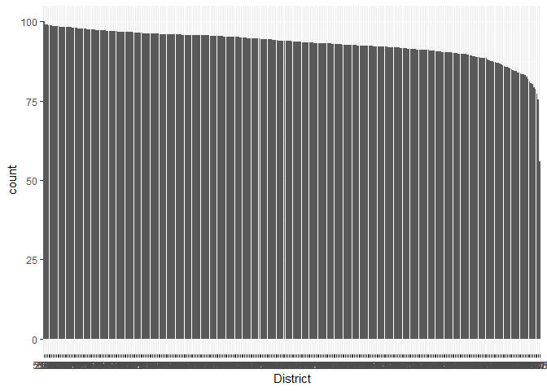<!-- -->

    ## # A tibble: 364 × 2
    ##    District.Name       avg.gr
    ##    <chr>                <dbl>
    ##  1 A-H-S-T               93.0
    ##  2 Adair-Casey           93.0
    ##  3 Adel-DeSoto-Minburn   93.0
    ##  4 Adel DeSoto Minburn   93.0
    ##  5 AGWSR                 93.0
    ##  6 AHSTW                 93.0
    ##  7 Akron Westfield       93.0
    ##  8 Albia                 93.0
    ##  9 Alburnett             93.0
    ## 10 Algona                93.0
    ## # … with 354 more rows

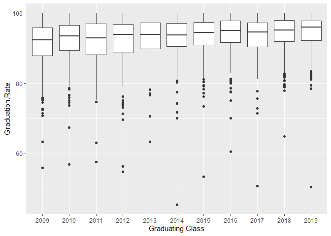<!-- -->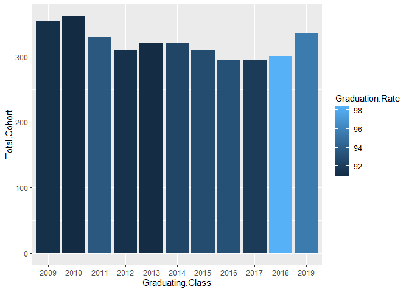<!-- -->

    ## Warning in grid.Call(C_stringMetric, as.graphicsAnnot(x$label)): font family not
    ## found in Windows font database

    ## Warning in grid.Call(C_stringMetric, as.graphicsAnnot(x$label)): font family not
    ## found in Windows font database

    ## Warning in grid.Call(C_textBounds, as.graphicsAnnot(x$label), x$x, x$y, : font
    ## family not found in Windows font database

    ## Warning in grid.Call(C_textBounds, as.graphicsAnnot(x$label), x$x, x$y, : font
    ## family not found in Windows font database

    ## Warning in grid.Call(C_textBounds, as.graphicsAnnot(x$label), x$x, x$y, : font
    ## family not found in Windows font database

    ## Warning in grid.Call(C_textBounds, as.graphicsAnnot(x$label), x$x, x$y, : font
    ## family not found in Windows font database

    ## Warning in grid.Call(C_textBounds, as.graphicsAnnot(x$label), x$x, x$y, : font
    ## family not found in Windows font database

    ## Warning in grid.Call(C_textBounds, as.graphicsAnnot(x$label), x$x, x$y, : font
    ## family not found in Windows font database

    ## Warning in grid.Call(C_textBounds, as.graphicsAnnot(x$label), x$x, x$y, : font
    ## family not found in Windows font database

    ## Warning in grid.Call(C_textBounds, as.graphicsAnnot(x$label), x$x, x$y, : font
    ## family not found in Windows font database

    ## Warning in grid.Call.graphics(C_text, as.graphicsAnnot(x$label), x$x, x$y, :
    ## font family not found in Windows font database

    ## Warning in grid.Call(C_textBounds, as.graphicsAnnot(x$label), x$x, x$y, : font
    ## family not found in Windows font database

    ## Warning in grid.Call.graphics(C_text, as.graphicsAnnot(x$label), x$x, x$y, :
    ## font family not found in Windows font database

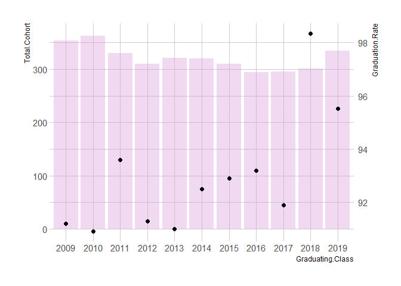<!-- -->

For graduation rate vs district: based on the output graph, it is too
concentrated to tell if there is any relationship between district and
graduation rate.

For graduation rate vs graduating class: Graduation class do have a
little effect on the graduation but not significant. The median
graduation and 75% quantile is not affecting by graduation year but the
25% quantile has a increasing trend from graduation class 2011-2016.

For Ames graduation rate: both total cohort and graduation class are not
factors that affects graduation rate

## Results 2

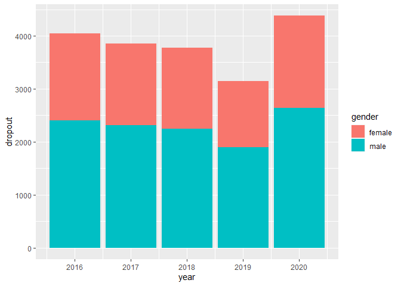<!-- -->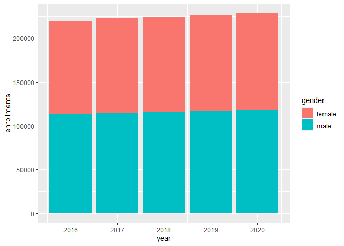<!-- -->
These two bar plot shows overall number of enrollments and dropout by
year. We notice that the overall enrollments is increating by year, but
overall dropout is decreasing from 2016 to 2019, and it suddenly
increase a lot in 2020. This is pretty strange, there should be some big
event happened there. We guess that it is because the appearance of
covid-19. On the other hand, the ratio of female and male enrollments
are close to 50 50, however, as for dropouts, male obviously account for
a greater proportion. It means that male has higher dropout rate than
female in IOWA.

<!-- --> The next plot
shows total dropout rate by year, which is a changing form of the
previous plot. It display a more obvious trend.

<!-- --> In order to
view the rate of change by year, we made this plot.This is the accurate
change of overall dropout rate by year. Same as what we see in the
previous plot, the rate change are negative from 2016 to 2019, and a big
increasing appear in 2020.

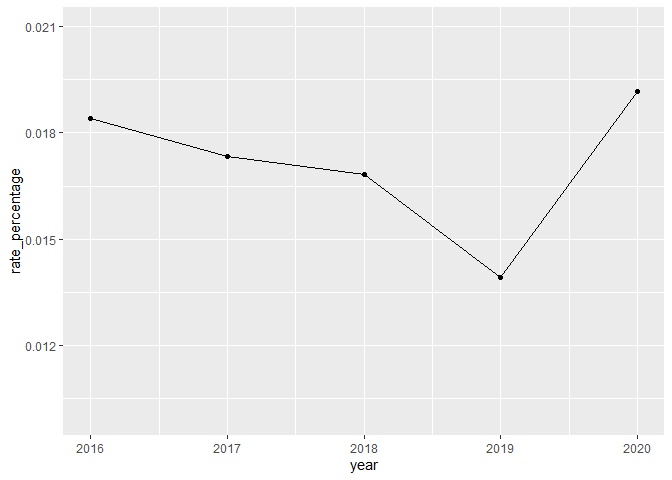<!-- --> This plot
shows ranked mean dropout rate by district colored by gender. The mean
rate is calculated by accumulated overall rate divided by number of
districts which is the numer of rows. we can see the distribution of
dropout rate by district.
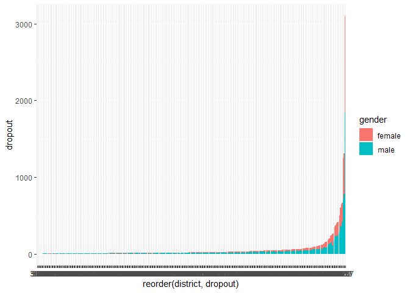<!-- --> Comparing
with next plot which shows dropout count by district, we can see that
the distribution is pretty different.The gap between districts is
larger. Most of the districts have very low dropouts, there are only a
new extreme large value. One district even has about 3000 overall
dropout. It is very abnormal to have such an outlier, but it is hard to
find out what caused the out lier based on the current data.

## Results 3-contribution to overall dropout based on number of dropout region

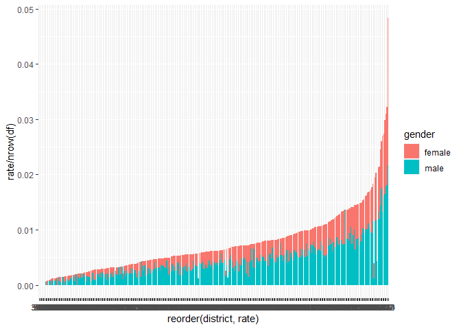<!-- -->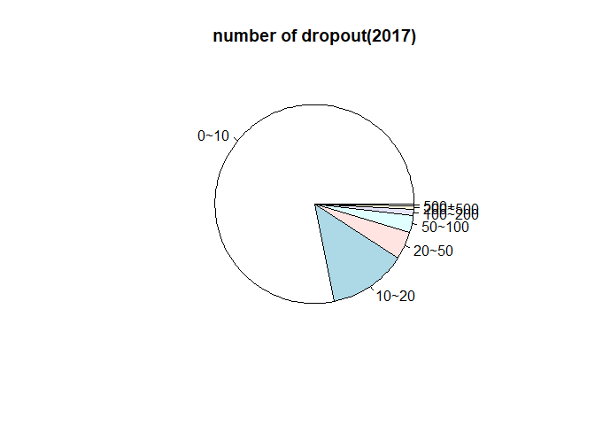<!-- --><!-- -->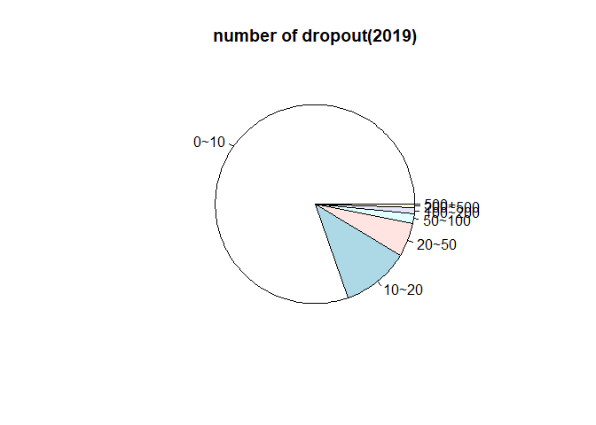<!-- -->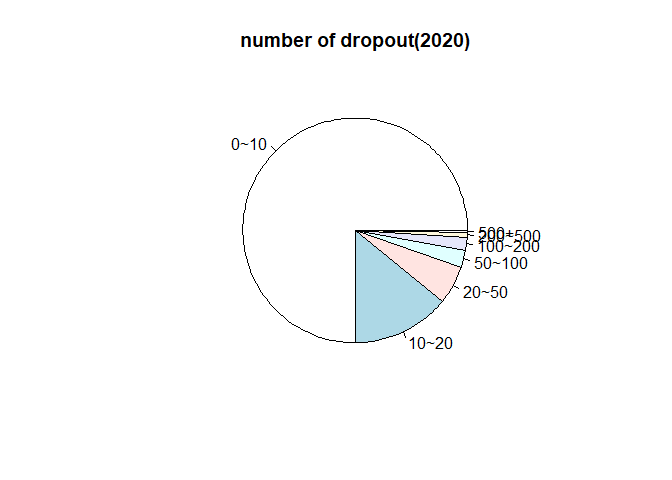<!-- -->
Next, we divided number of dropouts into different regions as listed
below, and made pie plot by year. We can see that district with less
than 10 dropouts each year actually takes more than 75 percent of the
total dropout. But in 2020, the percentage suddenly decreased. and
number of dropout between 10 and 20 obviously increased, and number of
dropout larger than 20 also increased a little bit. this means instead
of only several districts, the increase in number of dopout in 2020 is
is a large-scale phenomenon.

## Results 4-results after analyzing graduation intention

    ## # A tibble: 6 × 11
    ##   Graduation.Y…¹ sum.D…² sum.P…³ sum.P…⁴ sum.P…⁵ sum.C…⁶ sum.O…⁷ sum.E…⁸ sum.H…⁹
    ##   <chr>            <dbl>   <dbl>   <dbl>   <dbl>   <dbl>   <dbl>   <dbl>   <dbl>
    ## 1 2012             32548    4204    8681   12264     296     766    2948      61
    ## 2 2013             32920    4188    8869   12430     252     779    3300      39
    ## 3 2014             32748    4068    9013   12221     201     738    3306      47
    ## 4 2015             33003    3650    9542   12158     176     797    3474      54
    ## 5 2016             30124    3475    8583   11054     169     795    3391      43
    ## 6 2017             30782    3537    8688   11081     159     741    3675      24
    ## # … with 2 more variables: sum.Military <dbl>, sum.Unknown <dbl>, and
    ## #   abbreviated variable names ¹​Graduation.Year, ²​sum.Diploma.Count,
    ## #   ³​sum.Private.4.Year.College, ⁴​sum.Public.4.Year.College,
    ## #   ⁵​sum.Private.2.Year.College, ⁶​sum.Community.College, ⁷​sum.Other.Training,
    ## #   ⁸​sum.Employment, ⁹​sum.Homemaker

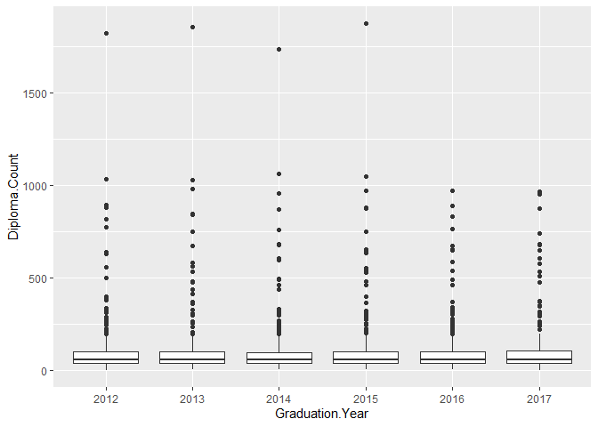<!-- -->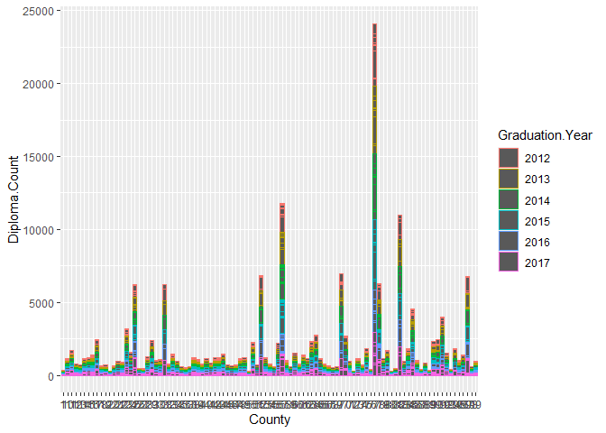<!-- -->

    ## # A tibble: 99 × 2
    ##    County sum.diploma
    ##    <chr>        <dbl>
    ##  1 1              346
    ##  2 10            1142
    ##  3 11            1672
    ##  4 12             770
    ##  5 13             690
    ##  6 14            1122
    ##  7 15            1224
    ##  8 16            1391
    ##  9 17            2425
    ## 10 18             635
    ## # … with 89 more rows

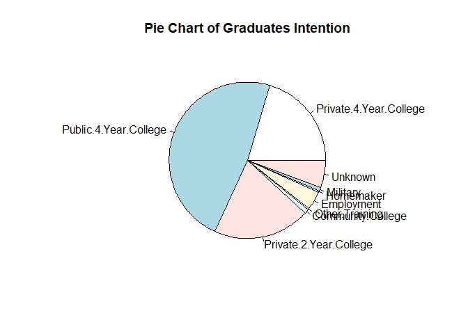<!-- -->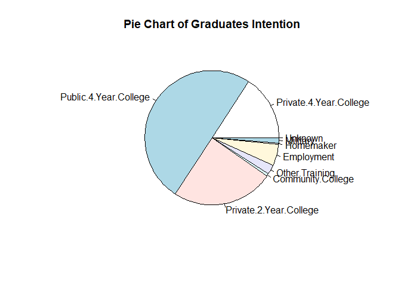<!-- -->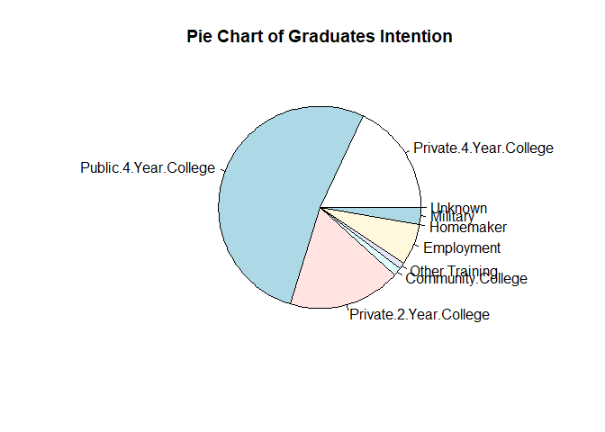<!-- -->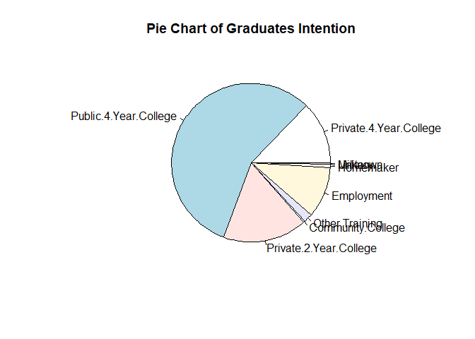<!-- -->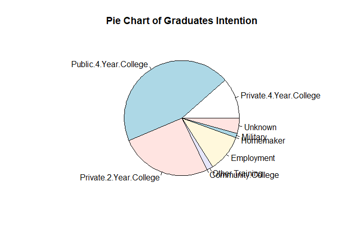<!-- -->

Summarize by graduation year: Most students will go to
college(Private.4.Year.College, Public.4.Year.College,
Private.2.Year.College, Community.College are considered college) after
graduate. Employment is a popular choice for those who are not going to
college.

Graduation year vs diploma count: Graduation year is not a factor that
affects diploma count

County vs diploma count: County is a factor that affect diploma count.
County 77 has the most diploma in year 2012-2018.This does not mean
County 77 has the highest graduation rate because we don’t know how many
`Total.Cohort` (as it called in the graduation data) in this county

Pie charts: most graduates would like to go to college.4 year public
college is the most popular choice, about half of graduates will go to 4
year public college every year.

# Conclusions

Give a quick summary of your work. Here is the place to be a bit
critical and discuss potential limitations. Add a sentence on what else
you would have liked to include in your data exploration if you had more
time or more members in your team.

From our analysis, we find that graduation class do have a little effect
on the graduation but not significant. For Ames, both total cohort and
graduation class are not factors that affects graduation rate. The
overall dropout are decreasing from 2016 to 2019, but suddenly increased
in 2020, while the overall enrollments is increasing. We also notice
that The district with number of dropouts below than 10 each year
contributes more than 75% of total dropouts.However, we find some
connection with the districts and dropouts but not able to seek a very
sighnificant finding on this part.

If we had more time and more data we could make analysis of the dropout
rate with covid data

## Data source

Where does the data come from, who owns the data? Where are all the
scripts that you need to clean the data?

The Iowa government website owns the data.

<https://data.iowa.gov/Primary-Secondary-Ed/4-Year-Graduation-Rates-in-Iowa-by-Cohort-and-Publ/tqti-3w6t.This>

<https://educateiowa.gov/document-type/graduate-intentions-district-including-graduate-counts>

<https://educateiowa.gov/graduation-rates-and-dropout-rates>

We get these 3 datasets from Iowa government website and all the scripts
can be found in ‘Quick Data Summary’ above.

## References

List all resources you used.

<https://www.earnest.com/blog/graduation-and-retention-rates/>
